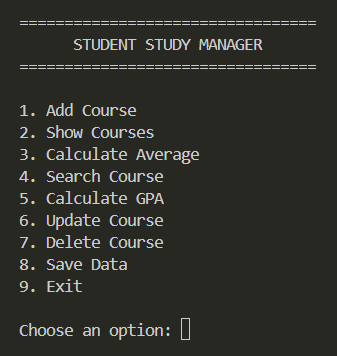
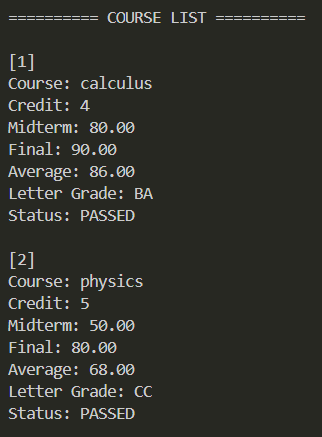
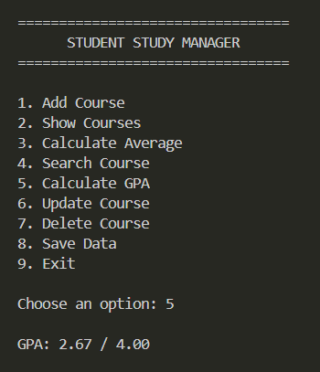
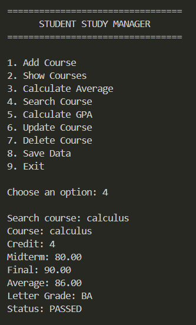

# Student Study Manager

A simple console-based student course and grade management system developed in C.

The project was created to practice fundamental C programming concepts such as structures, arrays, functions, pointers, string operations and file handling.

## Features

- Add courses
- Display all courses
- Calculate course averages
- Search for courses
- Calculate GPA
- Update course information
- Delete courses
- Save course data to a file
- Load saved data automatically
- Validate grades and credits
- Show pass/fail status

## Screenshots

### Main Menu



### Course List



### GPA Calculation



### Course Search



## Course Information

For each course, the program stores:

- Course name
- Credit
- Midterm grade
- Final grade

The course average is calculated using:

```text
Average = Midterm × 0.40 + Final × 0.60
